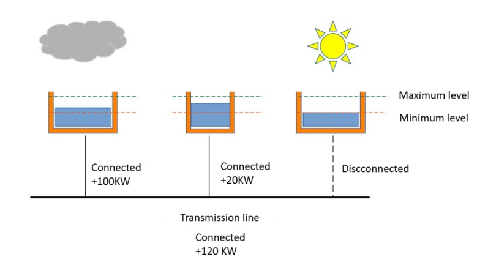

# Hydroelectric Plant Simulation Project
<p align="center"></p>

## Overview

This project simulates the operation of a hydroelectric power plant system. It utilizes concurrent programming techniques to manage multiple hydroelectric plants and optimizes system efficiency through parallel execution and CPU affinity. The simulation includes random weather events affecting water levels and dynamic activation and deactivation of plants based on capacity and water levels.

## Key Objectives

- Simulate hydroelectric plants with varying capacities and water level constraints.
- Implement concurrent threads to represent individual plant operations.
- Use CPU affinity to enhance thread performance and efficiency.
- Dynamically activate and deactivate plants based on water levels and total capacity requirements.
- Utilize semaphore and mutex for thread synchronization and safe resource access.

## Getting Started

### Prerequisites

- Linux environment with support for pthread and thread affinity.
- Standard C library for compiling and running the program.

### Compilation

1. **Build the Executable**:
   To compile the program and generate the executable file, run the following command in the terminal:

    ```bash
    $ make
    ```

### Running the Program

2. **Execute the Program**:
   Once compiled, you can run the program using the command with appropriate arguments for probabilities and the number of plants for each type:

    ```bash
    $ ./blackout prob_no_rain prob_downpour prob_flood num_h1 num_h2 num_h3
    $ ./blackout 0.9 0.05 0.05 10 10 30
    ```

   This command runs the simulation with specified probabilities prob_no_rain, prob_downpour, prob_rain_shower for weather events and a given number of hydroelectric plants of types H1, H2, and H3.

### Key Components

- **Hydroelectric Plants**: Represented by threads, each plant has a capacity, minimum and maximum water levels, and can be activated or deactivated based on conditions.
- **Weather Simulation**: Random weather events affect the water levels of each plant.
- **Greedy Algorithm**: Dynamically calculates the optimal combination of active plants to meet energy generation requirements.
- **Sorting Thread**: Continuously sorts the plants based on capacity and water levels.
- **Signal Handling**: Gracefully handles shutdown requests (e.g., SIGINT) to terminate the simulation.

## Author

Santiago Tumbaco
